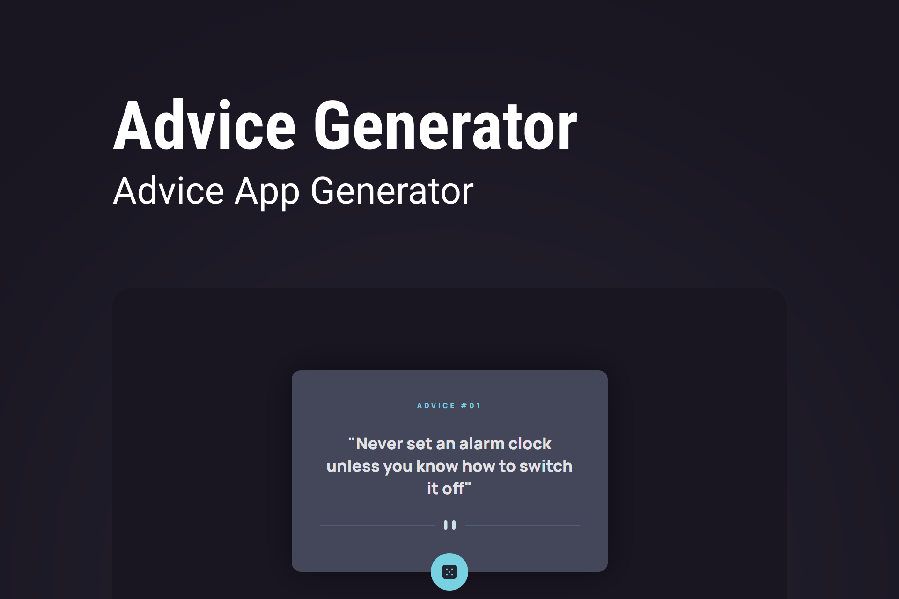

<h1 align="center">
  
</h1>

<h3 align="center">
  Advice Generator 🎲
</h3>

<p align="center">A small application for generating advice.</p>

<p align="center">
  

  <a href="https://www.linkedin.com/in/matheralvs/" target="_blank" rel="noopener noreferrer">
    
  </a>
  
  <a href="https://github.com/matheralvs/advice-generator/commits/main">
    
  </a>

  <a href="https://github.com/matheralvs/advice-generator/issues">
    
  </a>
</p>

<p align="center">
  <a href="#-about-the-project">About the project</a> •
  <a href="#-technologies">Technologies</a> •
  <a href="#-getting-started">Getting started</a> •
  <a href="#-how-to-contribute">How to contribute</a>
</p>

## ✅ About the project

This project is a challenge from the [Frontend Mentor](https://www.frontendmentor.io/challenges/advice-generator-app-QdUG-13db) page, which consists of generating, through the [Advice Slip](https://api.adviceslip.com/) public api, a series of random advices at the click of a button.

## 🚀 Technologies

Technologies that I used to develop this api

- [HTML](https://developer.mozilla.org/pt-BR/docs/Web/HTML)
- [CSS](https://developer.mozilla.org/pt-BR/docs/Web/CSS)
- [Javascript](https://www.javascript.com/)

## 💻 Getting started

**Clone the project and access the folder**

```bash
$ git clone https://github.com/matheralvs/advice-generator.git && cd advice-generator
```

## 🤔 How to contribute

**Make a fork of this repository**

```bash
# Fork using GitHub official command line
# If you don't have the GitHub CLI, use the web site to do that.

$ gh repo fork matheralvs/advice-generator
```

**Follow the steps below**

```bash
# Clone your fork
$ git clone your-fork-url && cd advice-generator

# Create a branch with your feature
$ git checkout -b my-feature

# Make the commit with your changes
$ git commit -m 'Feature: My new feature'

# Send the code to your remote branch
$ git push origin my-feature
```

After your pull request is merged, you can delete your branch.

Made with :purple_heart: by Matheus Alves 🤝 [See my linkedin](https://www.linkedin.com/in/matheralvs/)
